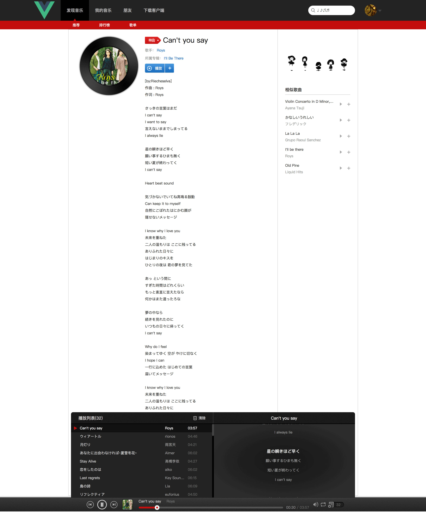

# vue-music

演示地址：<https://daief.tech/vue-music/>

API 服务太久没访问时服务器会被冻结，等待启动需要一点时间，此时会有假数据（部分）作为占位。

## 介绍

使用 vue、vue-router、vuex，山寨一个网易云音乐的 pc 网页版，仅用于个人学习，借此认识前端模块化编程、单页应用、webpack 资源打包等概念。
后来学习了 TypeScript，加上想复习 Vue，计划使用 Vue 2、Vue CLI 3+、TypeScript 将项目进行重新编写。

目录介绍：

- `NeteaseCloudMusicApi/` 是 api 服务，提供网易云音乐接口
- `preview/` 预览截图
- `scripts/` 自定义脚本
- 其他目录为 Vue CLI 3+ 生成的结构

## API 来源

[NeteaseCloudMusicApi](https://github.com/Binaryify/NeteaseCloudMusicApi)

## 学习记录

https://daief.github.io/2017-09-04/record-of-vue-music.html

## 本地启动

下载 API 项目。

```bash
# 脚本中的版本号对应仓库的 tag，可自行修改
$ yarn clone:api
```

```bash
# 安装依赖
$ yarn

# 本地启动 API 服务
$ yarn start

# 本地启动 Vue 开发服务
$ yarn serve
```

或使用 Docker 启动 API 服务。

```bash
# 构建镜像
$ docker image build -t NeteaseCloudMusicApi .
# 启动容器
$ docker container run -d -p 3000:3000 --rm NeteaseCloudMusicApi
```

API 地址访问 <http://localhost:3000/>

页面地址访问 <http://localhost:8080/>。

部署 API 服务到 [now](https://zeit.co/)。

```bash
$ yarn now
```

## TypeScript 重写

于 2018-11-02 开始用 TypeScript 重写工程，龟速推进中......

- [x] 底部歌曲播放条
  - [x] 暂停、播放、上下首切换
  - [x] 自定义歌曲进度条、进度调节
  - [x] 音量调节
  - [x] 切换播放模式
  - [x] 歌词滚动
  - [x] 列表歌曲切换、删除
  - [x] 加了个简单的音乐波形跳动

<!-- 界面 -->


